<div align="center">



<br/>

[](https://psychebear.github.io/Wasteland_Tactics/)
[](https://github.com/PsycheBear/Wasteland_Tactics)


</div>


```
> INCOMING TRANSMISSION FROM VAULT-OS v2.77 ...
> DECRYPTING ............................. [OK]
> WELCOME, OVERSEER.
```

Draft a squad of mutants, raiders, vault dwellers, and rogue robots. Manage your caps, slot together salvaged gear, and survive escalating waves of horrors crawling out of the wastes. Every fight runs on autopilot — your edge lives in the **draft, the synergies, and the build**.


##  FEATURES

| | |
|---|---|
| **Unit Drafting** | 22 units across 8 synergy traits — pull from a shared shop and roll for upgrades |
| **Synergy Engine** | Stack matching traits to unlock tiered buffs that warp the whole fight |
| **Item Crafting** | 6 components combine into 10 completed items — equip up to 3 per unit |
| **Augments** | Strategy-defining mutations offered at key rounds |
| **Boss Encounters** | Unique boss rounds with custom mechanics and intro sequences |
| **Auto-Combat** | Pip-Boy-styled animations, floating damage, status effects, ability flashes |
| **Persistent Saves** | Local-storage checkpoints — close the tab and pick up where you left off |
| **Mobile Ready** | Responsive layout scales down to phone screens |


##  QUICK START

```bash
# Clone the vault
git clone https://github.com/PsycheBear/Wasteland_Tactics.git
cd Wasteland_Tactics

# Install dependencies
npm install

# Boot the terminal (dev server)
npm run dev
```

Vite will print a local URL — usually `http://localhost:5173`.

### Production build

```bash
npm run build      # outputs to dist/
npm run preview    # serve the built bundle locally
```


##  DEPLOYMENT

Auto-deployed to **GitHub Pages** on every push to `Main` via the workflow at [`.github/workflows/deploy-pages.yml`](.github/workflows/deploy-pages.yml).

**Live build:** https://psychebear.github.io/Wasteland_Tactics/


##  TECH STACK

```
┌──────────────────────────────────────────────┐
│  Frontend ............... React 18           │
│  Bundler ................ Vite 6             │
│  Styles ................. CSS3 + Pip-Boy CRT │
│  State .................. React hooks        │
│  Persistence ............ localStorage       │
│  Deploy ................. GitHub Actions     │
└──────────────────────────────────────────────┘
```


##  PROJECT LAYOUT

```
src/
├── main.jsx              # entry point + error boundary
├── styles.css            # Pip-Boy theme, animations, responsive rules
├── components/
│   ├── Game.jsx          # root game component
│   └── UiComponents.jsx  # shared UI primitives
├── data/
│   ├── units.js          # 22 unit defs
│   ├── traits.js         # 8 synergy traits
│   ├── items.js          # components + completed items
│   ├── augments.js       # round-reward augments
│   ├── bosses.js         # boss encounters
│   ├── constants.js
│   └── images.js
└── systems/
    ├── combat.js         # auto-combat loop
    └── audio.js          # SFX + music
```


##  CREDITS

Built by **[PsycheBear](https://github.com/PsycheBear)** with contributions from **[Jordan Salvador](https://github.com/SalvadorJordan112306)**.

```
> END TRANSMISSION
> WAR. WAR NEVER CHANGES.
```
